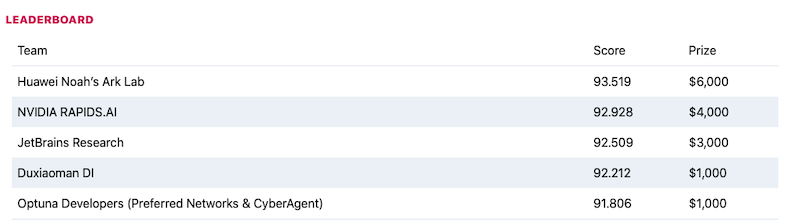

# JetBrains Research's Solution for Black-Box Optimization Challenge

This is the code for our solution to the [NeurIPS 2020 Black-Box Optimization Challenge](https://bbochallenge.com/).

Our solution is described in the "Solving Black-Box Optimization Challenge via Learning Search Space Partition for Local Bayesian Optimization" paper.

## Final Results

Our approach scored 92.509 in the finals and ranked 3rd overall!

## Team Members

* Mikita Sazanovich (github: [@niksaz](https://github.com/niksaz))
* Anastasiya Nikolskaya (github: [@nuvard](https://github.com/nuvard))
* Yury Belousov (github: [@bruce-willis](https://github.com/bruce-willis))
* Aleksei Shpilman

## LICENSE

Our implementation is released under [Apache License 2.0](./LICENSE) license except for the code derived from TuRBO.
